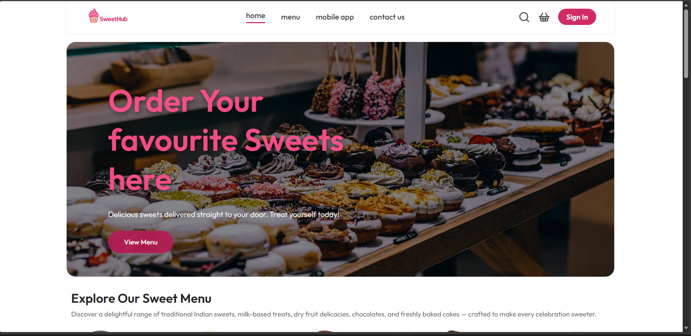
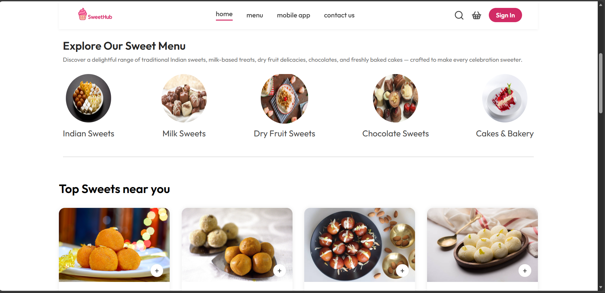
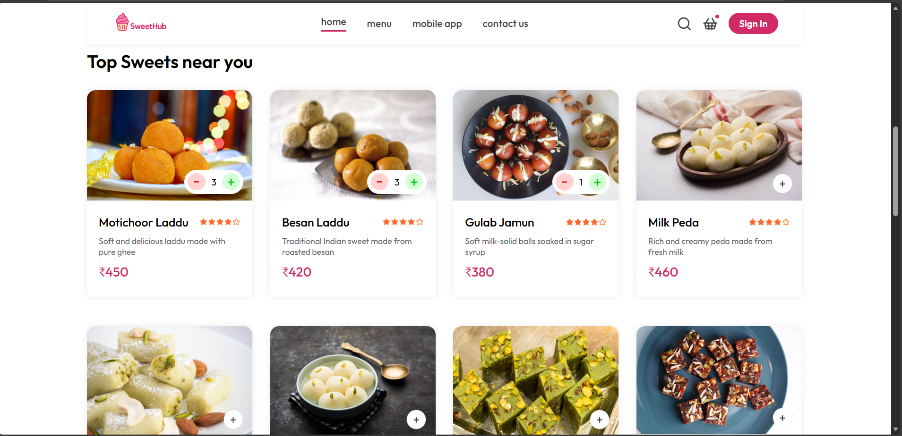
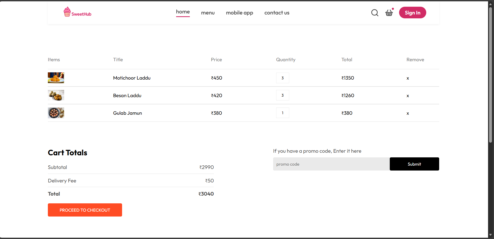
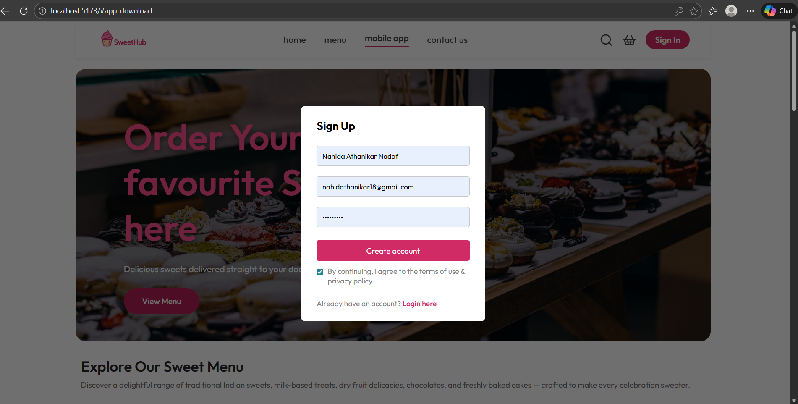
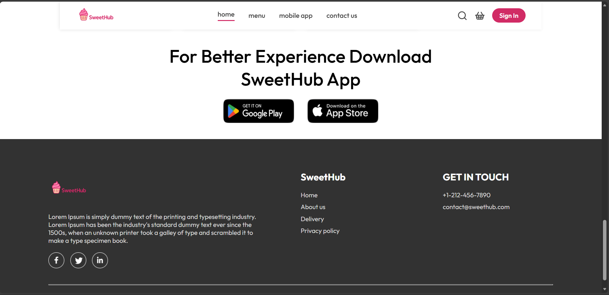
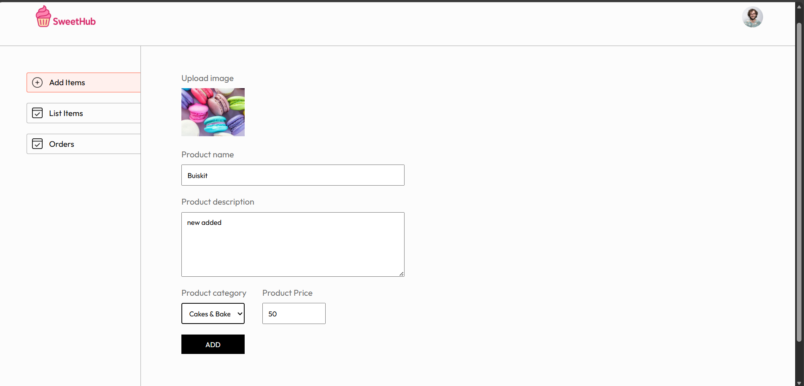

# 🍬 SweetHub – Sweet Shop Management System

A full-stack Sweet Shop Management System built with a modern frontend and a robust backend, following **Test-Driven Development (TDD)** practices. SweetHub allows users to browse sweets, manage carts, place orders, and enables admins to manage inventory and products.

---

## 🚀 Features

### 👤 User Features

* User registration & login
* Browse sweets by category
* Add sweets to cart
* Update quantity & remove items from cart
* Checkout with order summary

### 🛠️ Admin Features

* Secure admin authentication
* Add new sweets
* Update sweet details (price, quantity, category)
* Delete sweets
* Inventory restock & management

### 🧪 Development Practices

* Backend developed using **TDD (Red → Green → Refactor)**
* Clean and modular code structure
* Secure APIs with authentication
* Responsive UI for desktop, tablet, and mobile

---

## 🖼️ Application Screenshots (For HR Review)

> Below are some key snapshots of the SweetHub application showcasing UI and functionality.

### 🏠 Home Page



### 🍭 Explore Sweet Menu



### 🍭 Explore Sweet Menu Quantity wise



### 🛒 Cart Page



### 🔐 Sign Up / Login Modal



### 📱 App Download Page



### 📦 Admin Dashboard (Backend Connected)



> 📌 *All screenshots are taken from the running application during development.*

---

## ⚙️ Tech Stack

### Frontend

* React.js
* CSS 
* Responsive Design

### Backend

* Node.js
* Express.js
* REST APIs
* JWT Authentication

### Database

* MongoDB

### Testing

* Jest
* Supertest

---

## 🧑‍💻 Local Setup

### 1️⃣ Clone Repository

```bash
git clone https://github.com/nahida-athanikar/SweetHub

cd sweethub
```

### 2️⃣ Backend Setup

```bash
cd backend
npm install
npm run server
```

### 3️⃣ Frontend Setup

```bash
cd frontend
npm install
npm run dev
```

### 4 Admin Panel Setup

```bash
cd admin
npm install
npm run dev
```

---

## 🤖 My AI Usage

We were encouraged to use AI tools transparently and responsibly throughout this project. I leveraged the following AI tool to enhance my workflow:

**AI Tool Used:** ChatGPT (OpenAI)

### How I Used It:

* Used ChatGPT to generate and brainstorm multiple **logo and UI design concepts** for the SweetHub application.
* Took guidance for **responsive header and navigation bar layouts** for mobile, tablet, and desktop screens.
* Used AI suggestions to explore **color palettes and UI consistency**, then implemented the final design manually.
* Took help while **debugging UI issues**, structuring React components, and understanding best practices for frontend architecture.
* Used ChatGPT for **backend debugging support during TDD**, especially when resolving failing tests and edge cases.

### Impact on Workflow:

Using AI helped me overcome initial design blocks and reduced time spent on repetitive problem-solving. This allowed me to focus more on:

* Core backend logic
* Frontend feature implementation
* Writing and fixing test cases using TDD

AI acted strictly as an **assistant**, while all architectural decisions, implementations, testing, and final code were **written, verified, and reviewed by me**.

---

## 📌 Notes for HR 

* This project follows **industry-level coding standards**.
* Commit history reflects **TDD workflow** and incremental development.
* AI usage is fully transparent and compliant with project guidelines.

---

## 📬 Contact

**Developer:** Nahida Athanikar Nadaf
📧 Email: [nahidathanikar18@gmail.com](mailto:nahidathanikar18@gmail.com)

---

✨ *Thank you for reviewing SweetHub!*
